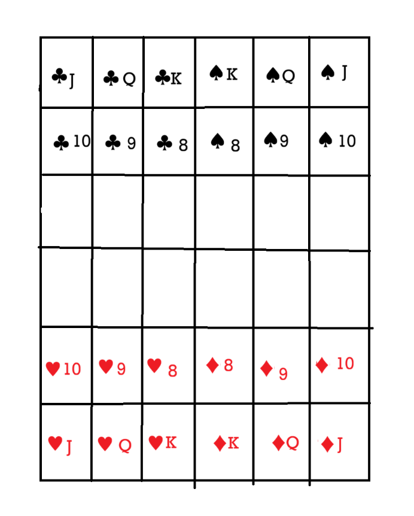

# 扑克牌棋

## 一、棋盘

两棋手分为红、黑双方，每方持两种花色。棋子摆放如下。

## 二、吃子规则

吃子时，只能颜色不同的子相吃。即不能自己吃自己。

### 1.两子权重不同时

除 1（A）外，权重的大子可以吃权重小的子。
权重排名：`J=Q=K>10>9>8>7>6>5>4>3>2>1`。
1（A）可以吃 JQK，但可以被 2\~10 的任一个吃。

若吃别人的子是 JQK 之一（这里只讨论两子权重不同，即被吃的子不是 JQK 之一），
则吃别人的子移到被吃的子的位置，被吃的子从棋盘上拿去；

若吃别人的子是除 1 的数字，则吃别人的子移到被吃的子的位置后，
变换为权重为「吃别人的子-被吃的子」、花色与吃别人的子相同的子，
被吃的子从棋盘上拿去；

若吃别人的子是 1（A）（ 这里只讨论两子权重不同，即被吃的子是 JQK 之一），
则吃别人的子移到被吃的子的位置，被吃的子从棋盘上拿去。

### 2.两子权重相同时

方片（♦）不可吃黑桃（♠ ），草花（♣ ）不可吃红桃（♥），
其余两子权重相同的情况皆可吃。吃别人的子和被吃的子都从棋盘上拿去。

## 三、走棋规则

只能在棋盘范围内走棋。若目标格无子或子可被吃，
数字棋和 J、K 可以沿上/下/左/右走一格；若目标格无子或子可被吃，
Q 可以沿四个对角线方向之一走一格； 若目标格无子，J 可以沿上/下/左/右走两格，

若目标格的子可被吃，且 J 和目标格之间必需隔一个子，则 J 可走到目标格并吃掉目标格的子。

## 四、胜负

两个 K 均被吃者输。

